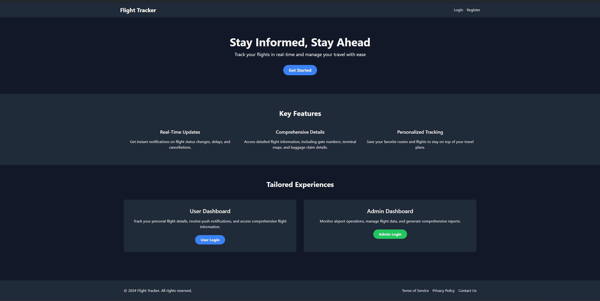

# Hack-to-Hire



## Table of Contents
1. [Introduction](#introduction)
2. [Features](#features)
3. [Technology Stack](#technology-stack)
4. [Project Structure](#project-structure)
5. [Setup and Installation](#setup-and-installation)
6. [Usage](#usage)
7. [API Endpoints](#api-endpoints)

## Introduction

Flight Status Tracker is a comprehensive web application designed to provide real-time flight information and status updates. It caters to both regular users and administrators, offering a seamless interface for tracking flights and managing flight data.

## Features

### For Users
- User registration and login
- Real-time flight status tracking
- Personalized dashboard with assigned flights
- Push notifications for flight updates


### For Administrators
- Secure admin login
- Comprehensive flight management (add, edit, delete)
- User management and flight assignment
- Overview of all flight statuses


## Technology Stack

### Frontend
- React.js
- Tailwind CSS for styling
- Axios for API requests

### Backend
- Flask (Python)
- MongoDB for database
- JWT for authentication

### Additional Services
- Twilio for SMS notifications

- SendGrid for email notifications

- Firebase for push notifications

## Setup and Installation

1. Clone the repository:

```
git clone https://github.com/retr0-kernel/Hack-to-Hire
cd flight-tracker
```

2. Set up the backend:

```
cd backend
python -m venv venv
venv/Scripts/activate 
pip install -r requirements.txt
```

3. Set up the frontend:

```
cd frontend
npm install
```

4. Create a `.env` file in the root directory and add your environment variables just like the `.env.example`

5. Start the backend server:

```
cd backend/venv
python app.py
```

6. Start the frontend development server:

```
cd frontend
npm start
```

## Usage

### User Registration


1. Navigate to the registration page.
2. Fill in the required details: username, email, phone number, and password.
3. Click "Register" to create your account.

### User Login


1. Go to the login page.
2. Enter your username and password.
3. Click "Sign in" to access your dashboard.

### Admin Login


1. Navigate to the admin login page.
2. Enter the admin credentials.
3. Click "Sign in" to access the admin dashboard.

### Managing Flights (Admin)
1. In the admin dashboard, you can add new flights, edit existing ones, or delete flights.
2. To assign a flight to a user, select a user from the dropdown next to a flight and click "Assign".

### Tracking Flights (User)
1. After logging in, your dashboard will display all flights assigned to you.
2. Click "Update Flights" to refresh the flight information.

## API Endpoints

- POST `/user/register` - Register a new user
- POST `/user/login` - User login
- POST `/admin/login` - Admin login
- GET `/flights` - Get all flights (user-specific)
- POST `/flights` - Add a new flight (admin only)
- PUT `/flights/<id>` - Update a flight (admin only)
- DELETE `/flights/<id>` - Delete a flight (admin only)
- GET `/admin/flights` - Get all flights (admin only)
- GET `/admin/users` - Get all users (admin only)
- POST `/admin/assign-flight` - Assign a flight to a user (admin only)

## Database Structure

- flights DB:


- users DB:


- notifications DB:


